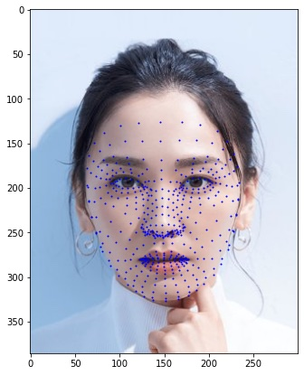
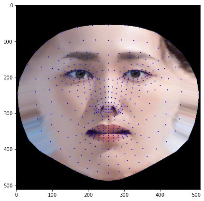
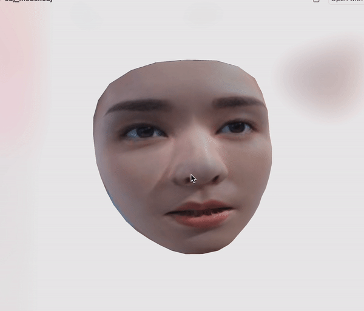

# 3dFaceReconstruction

This is a code snippet that can convert 468 mediapipe fatial landmarks into a .obj file, along with a .mtl and .jpg for the texture. Because Mediapipe is designed to work on mobile devices, this project should work quickly on most CPU or GPUs. 

Mediapipe is more accurate at detecting open eyes than some other face detection solutions, which allows this project to work decently well with illustrations as well as photos. Noses don't seem to be particularly accurate with this techinque

# Examples

<!--  -->
<!--  -->
<!--  -->
<!--  -->

# Setup
```pip install -r requirements.txt```

If for some resaon that fails, the required libraries are `cv2`, `numpy`, `mediapipe`, and `skimage`. 

# Usage
```python mediapipe_to_obj.py -i <input image path> -o <output path>```

If an input filename isn't provided, the program will prompt you for one.
If an output name isn't provided, it'll default to using `./results/<input_filename>.obj` as the output directory

# Known Issues
* Noses don't consistently match the reference image
* Completed OBJ is rotated
